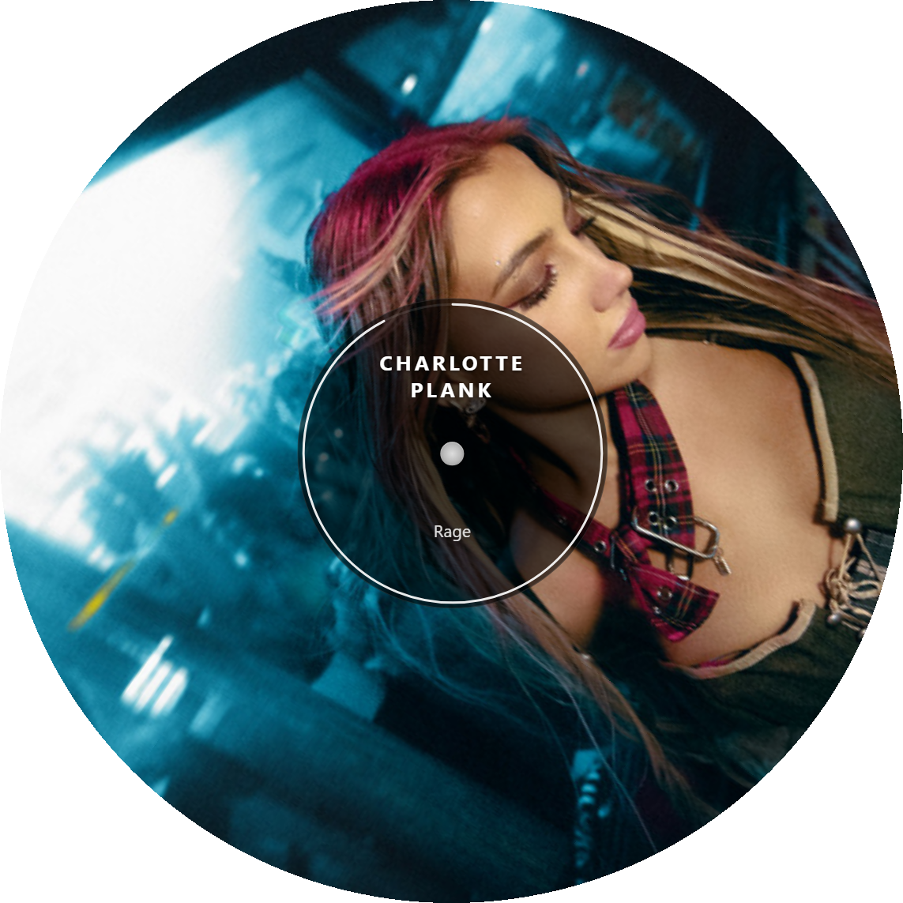

# SpotifyRoundPhobiControllerQT

<p align="center">
  
</p>

C++ Qt6/QML Spotify controller designed for a 1000x1000 round touchscreen display. Features rotating vinyl album art with 3D LP flip transitions, gesture-based playback control, and automatic square display detection.

## Download

Grab the latest release from the [Releases page](https://github.com/phobicdotno/SpotifyRoundPhobiControllerQT/releases). Extract the zip and run `SpotifyController.exe` — no installation or Qt required.

**Requirements:** Windows 10/11, Spotify Premium account.

## Spotify Setup

You need to create a free Spotify Developer app to get API credentials:

1. Go to the [Spotify Developer Dashboard](https://developer.spotify.com/dashboard)
2. Log in with your Spotify account
3. Click **Create app**
4. Fill in the form:
   - **App name:** anything you like (e.g. "Round Controller")
   - **App description:** anything
   - **Redirect URI:** `http://localhost:8888/callback` — click **Add**
   - **Which API/SDKs are you planning to use?** Select **Web API**
5. Click **Save**
6. On your app's page, click **Settings**
7. Copy your **Client ID** and **Client Secret**

### First Launch

1. Run `SpotifyController.exe`
2. Paste your **Client ID** and **Client Secret** into the setup screen
3. Click **Authenticate** — your browser will open to Spotify's login page
4. Grant permissions and you'll be redirected back automatically
5. The player will appear once authenticated

Credentials are saved locally — you only need to do this once.

> **Note:** Make sure Spotify is running somewhere (desktop app, web player, or another device) so the controller has an active device to control. If nothing is playing, tap the display to start playback on an available device.

## Gesture Reference

| Gesture | Action |
|---|---|
| Tap (outside center) | Play / Pause |
| Swipe Left | Next Track |
| Swipe Right | Previous Track |
| Swipe Up/Down | Show Track Info |
| Double-Tap (center) | Save / Like Track |
| Double-Tap (outside) | Toggle Shuffle |
| Two-Finger Drag Up/Down | Volume Up / Down |
| Hold 1s + Drag | Move Window |
| Hold 3s (no movement) | Close App |
| Escape Key | Close App |

## Build from Source

### Prerequisites

- Qt 6.8.3 (MinGW 13.1 kit) with modules: Quick, Network, Gui, Core5Compat, ShaderTools
- MinGW 13.1
- CMake 3.21+
- Ninja

### Build

```bash
cmake -B build -G Ninja \
  -DCMAKE_PREFIX_PATH=C:/Qt/6.8.3/mingw_64 \
  -DCMAKE_C_COMPILER=C:/Qt/Tools/mingw1310_64/bin/gcc.exe \
  -DCMAKE_CXX_COMPILER=C:/Qt/Tools/mingw1310_64/bin/g++.exe
cmake --build build
```

### Run

```bash
build/SpotifyController.exe
```
